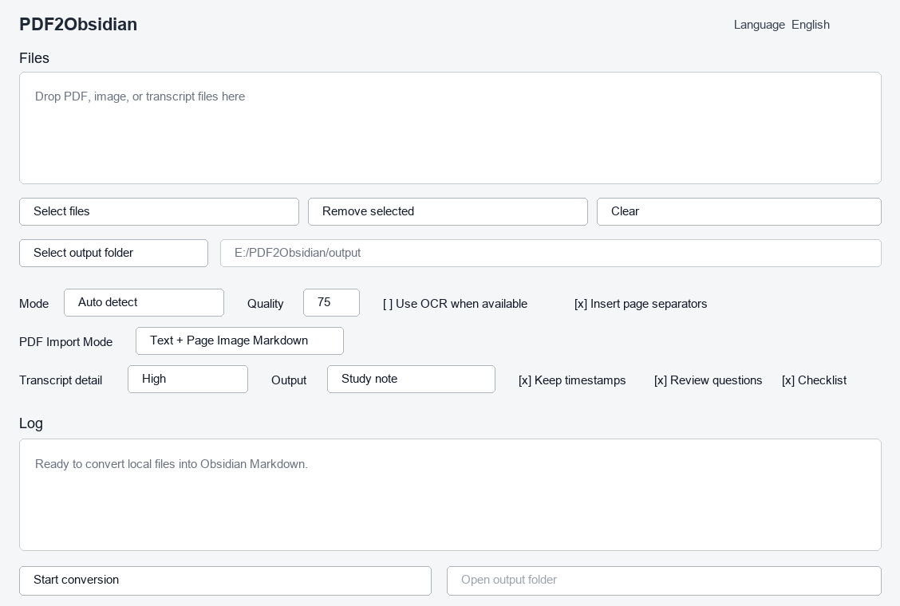

# PDF2Obsidian

🇺🇸 English | 🇰🇷 [한국어](README_ko.md)

[](https://github.com/Chokyusong/pdf2obsidian/actions/workflows/ci.yml)
[](https://github.com/Chokyusong/pdf2obsidian/releases)
[](LICENSE)

PDF2Obsidian is a local desktop tool that converts PDF, image, and lecture subtitle files into Obsidian-ready Markdown.

It is designed for Windows users who want to keep their files on their own computer. The app does not upload files to a server and does not use external AI APIs such as OpenAI, Claude, or Gemini.



## Project Goal

PDF2Obsidian helps students, researchers, and knowledge workers turn static learning material into reusable Obsidian notes. The first MVP focuses on reliable local conversion instead of cloud automation:

- PDF text layers become lightweight Markdown.
- PDF pages become visual WebP previews for layout fidelity.
- Embedded PDF images become compressed WebP assets.
- Images become compressed WebP assets plus Markdown.
- Lecture subtitles become structured study notes.
- Optional OCR runs only with locally installed OCR tools.

## Final Product Vision

The long-term goal is focused on two workflows:

1. Convert PDF files into Markdown without drifting away from the original visual layout.
2. Convert lecture or YouTube subtitles into detailed study material that can replace watching the original lecture.

The default workflow should stay different from cloud AI products. PDF2Obsidian should not require external AI APIs or required cloud uploads. Advanced AI features should be optional and user-controlled through local tools.

Target capabilities:

- PDF conversion: page-level WebP previews, layout-aware text extraction, embedded image extraction, and Obsidian Markdown output.
- Subtitle conversion: SRT/VTT/TXT/MD parsing, repeated speech cleanup, lecture-flow preservation, concept explanation, examples, procedures, cautions, and final summary.
- YouTube subtitle workflow: import downloaded YouTube subtitles first; direct URL support can be added later.
- Output: Markdown folder with assets, ready to move into an Obsidian vault.

## Why This Exists

Many PDF notes, lecture images, and subtitles are difficult to reuse in Obsidian. This project creates a simple local workflow:

1. Select a PDF, image, or subtitle file.
2. Convert pages or images to compressed WebP assets.
3. Generate Markdown with Obsidian wiki-style image links.
4. Open the output folder and move the result into your vault.

## Main Features

- Convert PDF files to Markdown.
- Extract PDF page text with PyMuPDF.
- Render PDF pages as WebP previews.
- Extract embedded PDF images as compressed WebP assets.
- Choose PDF import mode: Text Markdown, Page Image Markdown, or Text + Page Image Markdown.
- Convert PNG, JPG, JPEG, and WebP images to compressed WebP.
- Optional OCR wrapper with EasyOCR first and Tesseract fallback.
- Convert SRT, VTT, TXT, and MD lecture transcripts into structured learning notes.
- Preserve lecture timestamp order when available.
- Generate Obsidian-friendly Markdown.
- Minimal PySide6 desktop GUI with drag and drop.
- Core conversion logic is separated from GUI code for future CLI or web app use.

## Quick Links

- [Examples](docs/examples.md)
- [Roadmap](docs/roadmap.md)
- [Web app plan](docs/webapp-plan.md)
- [Contributing](CONTRIBUTING.md)

## Installation

Python 3.11 or later is recommended.

```powershell
python -m venv .venv
.\.venv\Scripts\Activate.ps1
pip install -r requirements.txt
```

The `requirements.txt` file installs the local package in editable mode, so this command works from the project root:

```powershell
python -m pdf2obsidian.main
```

## Usage

1. Run the app.
2. Add PDF, image, or subtitle files with the file button or drag and drop.
3. Choose an output folder.
4. Choose image quality: 60, 75, or 90.
5. Enable OCR only when you have a local OCR engine installed.
6. Click `Start Conversion`.
7. Open the output folder after conversion.

Default output is created under:

```text
output/
```

## Obsidian Output Example

For `sample.pdf`:

```text
output/
└─ sample/
   ├─ sample.md
   └─ assets/
      ├─ page_001.webp
      └─ image_p001_001.webp
```

Markdown example:

```markdown
---
title: "sample"
source_file: "sample.pdf"
created: "2026-06-25"
type: "pdf-import"
---

# sample

## Page 1

![[assets/page_001.webp]]

### Extracted text

Extracted text...

### Extracted image image_p001_001.webp

![[assets/image_p001_001.webp]]
```

For `lecture.vtt`, the app creates a study note with overview, concepts, timeline sections, checklist, review questions, and Obsidian keyword links.

## PDF Import Modes

- `Text Markdown`: extracts searchable text and embedded PDF images.
- `Page Image Markdown`: renders each PDF page as `page_001.webp`, `page_002.webp`, and inserts only page images.
- `Text + Page Image Markdown`: inserts the page image first, then extracted text, then embedded images. This is the default mode.

## Windows Notes

- If PowerShell blocks script execution, run:

```powershell
Set-ExecutionPolicy -Scope Process -ExecutionPolicy Bypass
```

- If PySide6 fails to install, upgrade pip first:

```powershell
python -m pip install --upgrade pip
```

## OCR Notes

OCR is optional. The app still works without OCR libraries.

EasyOCR can be installed manually:

```powershell
pip install easyocr
```

Tesseract fallback requires the Tesseract application plus Python wrapper:

```powershell
pip install pytesseract
```

Install Tesseract for Windows separately from the official project or a trusted package manager. If OCR is enabled but no OCR engine is available, the app writes a clear message instead of crashing.

## Build EXE

Install dependencies, then run:

```powershell
powershell -ExecutionPolicy Bypass -File build.ps1
```

The build script uses:

```powershell
pyinstaller --noconfirm --windowed --name PDF2Obsidian src/pdf2obsidian/main.py
```

PySide6 sometimes needs extra hidden imports or resource collection depending on the local environment. If the EXE opens with missing Qt plugin errors, rebuild after upgrading PyInstaller and PySide6.

## Development

Run tests:

```powershell
pytest
```

Run lint:

```powershell
ruff check .
```

## Roadmap

- Build toward a local-first study assistant experience.
- Improve OCR quality.
- Extract tables.
- Optimize output image dimensions.
- Add Markdown template settings.
- Add local web app mode.
- Add optional local LLM support only for better lecture-note reconstruction.
- Automate release builds.

## Future Web App Direction

The conversion logic lives under `src/pdf2obsidian/core/` so it can be reused from GUI, CLI, or FastAPI later.

The first web version should run locally on `localhost` and keep files on the user's PC. A hosted web version can be considered later with explicit privacy guidance and zip download support.

## GitHub Upload

Replace `<github-username>` with your GitHub username or use GitHub CLI:

```powershell
git init
git add .
git commit -m "Initial commit: PDF2Obsidian MVP"
git branch -M main
git remote add origin https://github.com/<github-username>/pdf2obsidian.git
git push -u origin main
```

With GitHub CLI:

```powershell
gh auth login
gh repo create pdf2obsidian --public --source=. --remote=origin --push
```

## Contributing

Issues and pull requests are welcome. Keep the project local-first, simple, and beginner-friendly. Do not add required cloud uploads, login, payments, or external AI API dependencies.

## License

MIT License. See [LICENSE](LICENSE).
