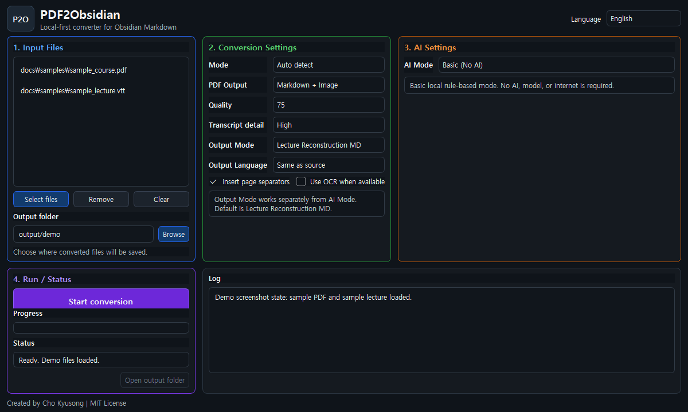
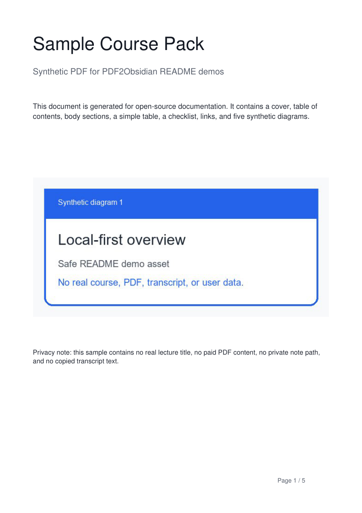
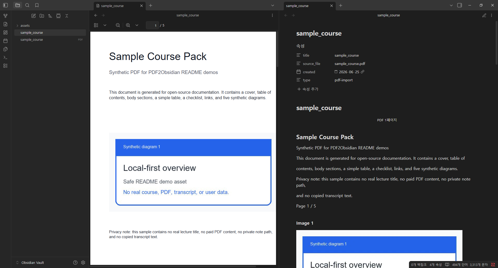
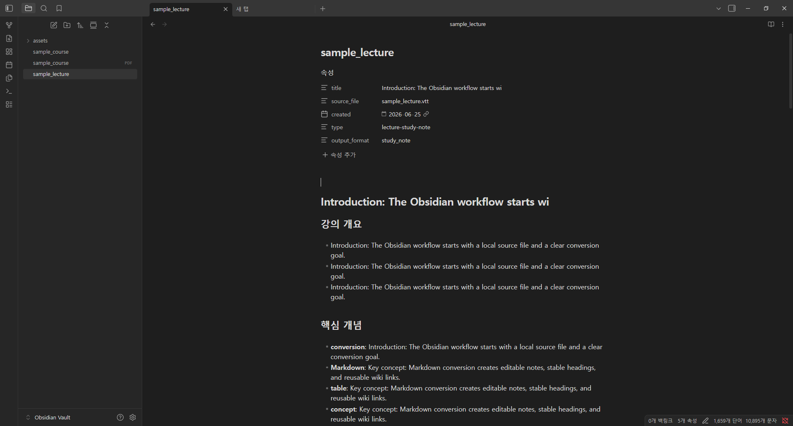
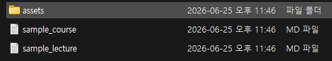

# PDF2Obsidian

🇺🇸 [English](README.md) | 🇰🇷 한국어

[](https://github.com/Chokyusong/pdf2obsidian/actions/workflows/ci.yml)
[](https://github.com/Chokyusong/pdf2obsidian/releases)
[](LICENSE)

## 제작자

Created and maintained by **Cho Kyusong**

GitHub: [Chokyusong/pdf2obsidian](https://github.com/Chokyusong/pdf2obsidian)

License: MIT

This project is open-source software released under the MIT License.

PDF2Obsidian은 Obsidian 사용자와 학습자료 관리자를 위한 local-first 오픈소스 데스크톱 도구입니다. PDF, 이미지, 강의 자막 파일을 Obsidian에서 바로 사용할 수 있는 Markdown 문서와 경량 assets 구조로 변환합니다.

사용자의 파일을 외부 서버로 업로드하지 않으며, OpenAI, Claude, Gemini 같은 외부 AI API를 필수로 사용하지 않습니다. Windows 사용자가 로컬에서 쉽게 실행하는 것을 1차 목표로 합니다.



## 다운로드

최신 Windows 빌드는 GitHub Releases에서 받을 수 있습니다.

- [PDF2Obsidian v0.1.5](https://github.com/Chokyusong/pdf2obsidian/releases/tag/v0.1.5)
- [Windows ZIP 다운로드](https://github.com/Chokyusong/pdf2obsidian/releases/download/v0.1.5/PDF2Obsidian-v0.1.5-windows.zip)

## 프로젝트 목표

PDF2Obsidian은 학생, 연구자, 지식관리 사용자들이 PDF와 강의 자료를 Obsidian 노트로 재사용할 수 있게 돕습니다. 1차 MVP는 클라우드 자동화보다 안정적인 로컬 변환에 집중합니다.

- PDF 텍스트 레이어를 경량 Markdown으로 변환
- PDF 구조를 가능한 범위에서 편집 가능한 Markdown으로 복원
- PDF 내부 이미지를 압축 WebP assets로 저장
- 이미지 파일을 WebP assets와 Markdown으로 변환
- 강의 자막을 구조화된 학습 노트로 변환
- OCR은 로컬에 설치된 OCR 도구가 있을 때만 선택적으로 실행

## 최종 제품 비전

장기 목표는 두 가지 흐름에 집중합니다.

1. PDF를 원본 시각적 레이아웃에서 벗어나지 않는 Markdown으로 변환합니다.
2. 강의 자막 또는 유튜브 자막을 영상 없이도 이해할 수 있는 상세 학습 자료로 변환합니다.

기본 흐름은 클라우드 AI 제품과 달라야 합니다. PDF2Obsidian은 외부 AI API나 클라우드 업로드를 필수로 요구하지 않습니다. 고급 AI 기능은 사용자가 직접 선택한 로컬 도구를 통해서만 선택적으로 연결합니다.

목표 기능:

- PDF 변환: 레이아웃 인식 텍스트 추출, 제목/목록/표 복원, 내장 이미지 추출, 표 영역 fallback, Obsidian Markdown 출력
- 자막 변환: SRT/VTT/TXT/MD 파싱, 반복 말투 정리, 강의 흐름 보존, 개념 설명, 예시, 절차, 주의사항, 강의 재구성
- 유튜브 자막 흐름: 먼저 다운로드한 유튜브 자막 파일을 입력받고, 추후 URL 직접 입력을 검토
- 출력: Obsidian vault로 바로 옮길 수 있는 Markdown 폴더와 assets 구조

## 왜 만들었나요?

PDF 자료, 강의 이미지, 자막 파일은 Obsidian에서 바로 재사용하기 어렵습니다. PDF2Obsidian은 다음 흐름을 단순하게 만듭니다.

1. PDF, 이미지, 자막 파일을 선택합니다.
2. 페이지나 이미지를 압축된 WebP assets로 저장합니다.
3. Obsidian Wiki Link 형식의 Markdown을 생성합니다.
4. 출력 폴더를 열어 Obsidian vault로 옮깁니다.

## 대상 사용자

- 정적인 PDF를 재사용 가능한 Markdown으로 바꾸고 싶은 Obsidian 사용자
- 수업 PDF, 도표, 강의 자막을 정리하는 학생
- 문서를 외부 서버로 보내지 않고 변환하려는 연구자
- 개인 지식관리 시스템을 운영하는 지식근로자
- 강의 자료를 검색 가능한 학습 노트로 준비하는 자료 관리자

PDF2Obsidian은 OpenAI, Claude, Gemini 또는 기타 외부 AI API 없이도 계속 사용할 수 있어야 합니다.

## 주요 기능

- PDF 파일을 Markdown으로 변환
- PDF 파일을 별도 출력 모드에서 압축 PDF로 변환
- PyMuPDF로 PDF 페이지 텍스트 추출
- PDF 텍스트 블록에서 간단한 제목, 굵은 글씨, 목록, 문단 추론
- 감지 가능한 PDF 표를 Markdown 표로 변환
- PDF 내부 이미지를 압축 WebP assets로 저장
- 단일 `manage-pdf-in-obsidian` 프로필로 PDF 변환
- PNG, JPG, JPEG, WebP 이미지를 압축 WebP로 저장
- EasyOCR 우선, Tesseract 대안 OCR 래퍼 제공
- SRT, VTT, TXT, MD 강의 자막을 학습 노트로 정리
- 자막 타임스탬프 순서 유지
- Obsidian에서 바로 열 수 있는 Markdown 생성
- PySide6 기반 최소 GUI와 드래그 앤 드롭 지원
- 추후 CLI 또는 웹앱 확장을 위해 핵심 변환 로직과 GUI 분리

## 빠른 링크

- [출력 예시](docs/examples.md)
- [로드맵](docs/roadmap.md)
- [유지보수 작업](docs/maintenance.md)
- [웹앱 확장 계획](docs/webapp-plan.md)
- [기여 안내](CONTRIBUTING.md)

## 설치 방법

Python 3.11 이상을 권장합니다.

```powershell
python -m venv .venv
.\.venv\Scripts\Activate.ps1
pip install -r requirements.txt
```

`requirements.txt`는 현재 프로젝트를 editable package로 설치하므로, 프로젝트 루트에서 아래 명령으로 실행할 수 있습니다.

```powershell
python -m pdf2obsidian.main
```

## 사용 방법

1. 앱을 실행합니다.
2. 파일 선택 버튼 또는 드래그 앤 드롭으로 PDF, 이미지, 자막 파일을 추가합니다.
3. 출력 폴더를 선택합니다.
4. 이미지 품질을 60, 75, 90 중에서 선택합니다.
5. `PDF/이미지 변환` 모드에서는 Output에서 `Markdown + Image` 또는 `WebP 압축`을 선택합니다.
6. OCR이 필요하고 로컬 OCR 도구가 설치되어 있으면 OCR을 켭니다.
7. `Start Conversion` 버튼을 누릅니다.
8. 변환 완료 후 output 폴더를 엽니다.

기본 출력 위치:

```text
output/
```

## Obsidian 출력 예시

`sample.pdf`를 변환하면 다음 구조가 생성됩니다.

```text
output/
└─ sample/
   ├─ sample.md
   └─ Files/
      └─ sample/
         ├─ p001-img01.webp
         └─ p002-table01.webp
```

Markdown 예시:

```markdown
---
title: "sample"
source_file: "sample.pdf"
created: "2026-06-25"
type: "pdf-import"
---

# sample

<p align="center"><sub>PDF 1페이지</sub></p>

## Main heading

본문 문단...

##### Table 1

| 항목 | 실행 |
| --- | --- |
| 예시 | 이렇게 하기 |

##### Image 1

![[Files/sample/p001-img01.webp]]
```

`lecture.vtt` 같은 강의 자막 파일은 강의 개요, 핵심 개념, 시간대별 정리, 체크리스트, 복습 질문이 포함된 학습 노트로 변환됩니다.

## 강의 노트 향후 방향

현재 강의 자막 변환은 자막을 Markdown 학습 노트 형태로 정리하는 MVP 단계입니다. 향후에는 단순 타임라인 정리를 넘어, 자막을 의미 단위로 병합하고 주제별로 재구성하여 Obsidian에서 바로 읽고 복습할 수 있는 학습 노트로 만드는 기능을 강화할 예정입니다.

기본 모드는 외부 AI API 없이 동작합니다. Local AI(Ollama)는 사용자의 PC에서만 실행되는 선택 기능입니다. OpenAI 호환 Cloud AI는 향후 고려하더라도 필수 의존성이 아닌 선택적 향상 기능으로만 다룹니다.

## AI Mode

강의 자막 처리는 앞으로 세 가지 AI Mode 구조를 가집니다.

- `Basic (No AI)`: 기본값입니다. 규칙 기반으로 동작하며 모델, 인터넷, 외부 API가 필요 없습니다.
- `Local AI (Ollama)`: Ollama가 사용자의 PC에 설치되어 실행 중일 때만 쓰는 한국어/영어 강의 재구성 선택 기능입니다.
- `Cloud AI (OpenAI Compatible) - Future`: 향후 선택 기능입니다. 기본값이 아니며 핵심 변환에 필요하지 않습니다.

AI Mode는 처리 엔진을 정하고, Output Mode는 결과물 형태를 정합니다.

- `Simple Note`: 짧은 복습 노트, 향후 모드
- `강의 재구성 MD`: 기본값, 강의 대체 학습자료 Markdown
- `Ebook`: 전자책형 원고, 향후 모드
- `검토 브리프`: 빠른 검토용 문서, 향후 모드

Output Language는 자막 노트의 출력 언어를 정합니다.

- `원문 언어 유지`: 오픈소스 기본값
- `한국어`: 영어 자막도 한국어 학습 노트로 재구성
- `영어`: 한국어 자막도 영어 학습 노트로 재구성

PDF2Obsidian은 클라우드 AI를 요구하지 않습니다. Basic 모드와 로컬 Ollama 모드에서는 파일이 사용자의 PC 안에서 처리됩니다. Ollama 설정과 모델 다운로드는 선택 기능이며, 사용자가 `Local AI (Ollama)`를 선택하고 설치/모델 버튼을 직접 누른 뒤 확인했을 때만 실행됩니다.

Ollama 자막 프롬프트는 한국어/영어 강의를 모두 지원하는 범용 프롬프트입니다. 특정 강의 전용 보존 키워드 하드코딩은 제거했고, 품질 검사는 Markdown 구조, 원문 범위 보존, 원문 밖 사실 생성 방지 중심으로 동작합니다.

추천 Ollama 모델:

- `qwen2.5:7b`: 일반 사용자와 한국어 강의 재구성 기본 추천
- `qwen2.5:3b`: 가벼운 테스트용
- `llama3.2:3b`: 일반 테스트용

Ollama는 설치 후 로컬에서 무료로 실행되지만, 변환 속도와 출력 품질은 선택한
모델과 사용자의 CPU, RAM, GPU, 저장장치 속도에 따라 달라집니다.
PDF2Obsidian은 기본 Local AI 변환에서 느린 반복 retry 대신 가벼운 정리 후
첫 결과를 저장합니다.

`qwen3.6` 같은 대형 실험 모델은 메모리를 많이 쓰고 일반 PC에서 느리거나
불안정할 수 있으므로 기본 추천 모델이 아닙니다.

## Local AI(Ollama) 자동 설정

PDF2Obsidian은 Local AI 모드를 위한 Ollama 설정 보조 기능을 제공합니다.

`Local AI (Ollama)`를 선택한 뒤 `Ollama 자동 설치`를 누르면 다음 흐름을 진행합니다.

1. Ollama 설치 여부 확인
2. Ollama 자동 설치
3. Ollama 서버 확인/시작
4. 추천 또는 선택 모델 다운로드
5. Local AI 모드 활성화

모델 선택기는 로컬 Ollama API를 통해 설치된 모델을 읽고, 실패하면 `ollama list` CLI fallback을 사용합니다. 자동 설정이 실패하면 `다운로드 페이지 열기`와 수동 설정 가이드를 사용하면 됩니다.

## Lecture Study Note Template

기본 자막 출력은 고정된 Obsidian 학습 노트 구조를 따릅니다. 핵심 개념, 설명, 예시, 숫자, 비교, 미션, 실행 단계, 복습 포인트를 보존하고 원문에 없는 사실은 만들지 않는 것이 원칙입니다. Ollama를 선택하면 자막 파일을 Obsidian에서 바로 읽을 수 있는 강의 대체 학습 노트로 재구성합니다.

자세한 구조는 [Lecture Study Note Template](docs/lecture-study-note-template.md)을 확인하세요.

Ollama 설치와 사용 순서는 [Ollama Setup Guide](docs/ollama-setup.md)를 확인하세요.

## 데모 변환 예시

이 저장소에는 공개 문서용으로 재현 가능한 synthetic 데모 파일이 포함되어 있습니다. 실제 강의명, 비공개 학습자료, 개인 파일 경로, 복사한 transcript text는 포함하지 않습니다.



데모 입력:

- [sample_course.pdf](docs/samples/sample_course.pdf): 표지, 목차, 본문 섹션, 단순 표 1개, 체크리스트, 링크, synthetic 다이어그램 5개를 포함한 PDF입니다.
- [sample_lecture.vtt](docs/samples/sample_lecture.vtt): 도입, 핵심 개념, 예시, 실습 안내, 정리, 복습 질문, 실행 미션 흐름을 가진 약 100개 타임라인 cue 자막입니다.

데스크톱 사용 흐름:


### PDF to Obsidian Markdown

샘플 PDF는 실제 PDF2Obsidian 변환기로 변환했습니다. 문서용으로 선별한 결과는 [sample_course.md](docs/demo-output/sample_course.md)에서 확인할 수 있습니다.



변환된 Markdown에는 다음이 포함됩니다.

- PDF 페이지 구분 표시
- 검색 가능한 텍스트와 추론된 heading
- PDF 표에서 변환된 Markdown table
- Obsidian Wiki Link로 연결된 WebP 이미지 assets 5개
- 페이지, 표, 이미지, 링크, 경고, 용량 정보를 포함한 변환 리포트

### Lecture Transcript to Study Note

샘플 VTT는 강의 자막 정리 모드로 변환했습니다. 문서용으로 선별한 결과는 [sample_lecture.md](docs/demo-output/sample_lecture.md)에서 확인할 수 있습니다.



변환된 노트에는 다음이 포함됩니다.

- 강의 개요
- 핵심 개념
- 타임스탬프 기반 강의 흐름
- 복습 질문
- 실행 문장이 감지된 경우 실행 체크리스트

### Output Folder Structure



```text
docs/
├─ samples/
│  ├─ sample_course.pdf
│  └─ sample_lecture.vtt
└─ demo-output/
   ├─ sample_course.md
   ├─ sample_lecture.md
   └─ assets/
      └─ sample_course/
         ├─ p001-img01.webp
         ├─ p002-img01.webp
         ├─ p003-img01.webp
         ├─ p004-img01.webp
         └─ p005-img01.webp
```

### Privacy Note

모든 데모 파일은 synthetic sample입니다. 개인 PDF, 비공개 학습자료, 복사한 강의 transcript text, 개인 Obsidian vault 경로, 로컬 PC 경로는 예시로 커밋하지 않습니다.

## 변환 전/후 예시

프로젝트 문서에는 합성 예시 또는 재배포 가능한 예시만 사용합니다. 개인 PDF, 비공개 강의자료, 실제 transcript text, 개인 Obsidian 노트는 예시로 커밋하지 않습니다.

변환 전:

```text
sample.pdf
├─ Page 1: 제목, 문단, 내장 도표
└─ Page 2: 단순 표와 출처 링크
```

변환 후:

```text
output/
└─ sample/
   ├─ sample.md
   └─ Files/
      └─ sample/
         ├─ p001-img01.webp
         └─ p002-table01.webp
```

생성된 Markdown은 작은 PDF 페이지 표시, 검색 가능한 텍스트, 가능한 Markdown 표, Obsidian Wiki Link 이미지, 변환 리포트를 포함합니다.

## PDF 변환 프로필

PDF 변환은 하나의 프로필만 사용합니다: `manage-pdf-in-obsidian`.

이 프로필은 PDF를 Obsidian에서 가볍고 편집 가능한 Markdown으로 바꾸는 데 집중합니다. 기본 변환에서는 전체 페이지 `page_001.webp` 이미지를 삽입하지 않습니다. 텍스트 레이어를 먼저 추출하고, 제목, 문단, 목록, Markdown 표, 링크, 필요한 이미지를 복원한 뒤 PDF assets는 `Files/<PDF 제목>/` 아래에 저장합니다.

PyMuPDF가 단순 표 구조를 감지할 수 있는 경우 Markdown 표로 출력합니다. 불규칙한 표는 깨진 Markdown으로 억지 변환하지 않고 표 영역만 WebP fallback으로 저장할 수 있습니다.

## PDF 압축

`PDF/이미지 변환` 모드에서 Output을 `WebP 압축`으로 선택하면 다음 산출물이 생성됩니다.

```text
output/
└─ sample/
   ├─ sample-compressed.pdf
   └─ sample-compression-report.md
```

이 압축 모드는 PDF 각 페이지를 이미지로 렌더링하고 WebP 기반 손실 압축을 적용한 뒤, 다시 작은 PDF로 재구성합니다. Markdown 변환과는 별도 기능이며, 텍스트 선택, 링크, 목차, 주석, 입력 폼은 보존되지 않을 수 있습니다.

## Windows 안내

PowerShell에서 스크립트 실행이 막히면 현재 세션에만 다음 명령을 적용할 수 있습니다.

```powershell
Set-ExecutionPolicy -Scope Process -ExecutionPolicy Bypass
```

PySide6 설치가 실패하면 pip를 먼저 업그레이드하세요.

```powershell
python -m pip install --upgrade pip
```

## OCR 안내

OCR은 선택 기능입니다. OCR 라이브러리가 없어도 PDF/Image/자막 변환 기능은 계속 사용할 수 있습니다.

EasyOCR 설치:

```powershell
pip install easyocr
```

Tesseract 대안을 사용하려면 Tesseract 프로그램과 Python wrapper가 필요합니다.

```powershell
pip install pytesseract
```

Tesseract for Windows는 별도로 설치해야 합니다. OCR을 켰는데 OCR 엔진이 없으면 프로그램은 종료되지 않고 안내 메시지를 Markdown에 남깁니다.

## EXE 빌드

의존성을 설치한 뒤 다음 명령을 실행합니다.

```powershell
powershell -ExecutionPolicy Bypass -File build.ps1
```

내부적으로 다음 PyInstaller 명령을 사용합니다.

```powershell
pyinstaller --noconfirm --windowed --name PDF2Obsidian src/pdf2obsidian/main.py
```

PySide6 환경에 따라 Qt plugin 또는 resource 관련 옵션이 추가로 필요할 수 있습니다. 실행 파일에서 Qt 관련 오류가 나면 PyInstaller와 PySide6를 업그레이드한 뒤 다시 빌드하세요.

## 개발

테스트 실행:

```powershell
pytest
```

Ruff 검사:

```powershell
ruff check .
```

## Codex 지원 활용 계획

Codex 지원은 오픈소스 유지보수 품질을 높이는 데 사용하며, 외부 AI API를 필수 런타임 의존성으로 만들지 않습니다. 계획은 다음과 같습니다.

- 실제 문서에서 PDF 변환 품질 개선
- PDF 텍스트 추출, 내장 이미지, 표, 자막 변환 회귀 테스트 추가
- Windows 빌드 검증 자동화
- Pull Request에서 privacy, local-first 동작, 유지보수성 검토
- private 파일명, 로컬 경로, 샘플 문서 하드코딩 여부 점검
- 개발자가 아닌 Obsidian 사용자를 위한 문서 개선

## 로드맵

- PDF 원본 시각적 레이아웃 보존 강화
- 강의/유튜브 자막 상세 정리 품질 개선
- OCR 품질 개선
- 표 추출
- 이미지 크기 최적화
- Markdown 템플릿 설정
- 로컬 웹앱 버전
- 자막 정리 품질 향상을 위한 선택적 로컬 LLM 연동
- exe 배포 자동화

## 향후 웹앱 확장

핵심 변환 로직은 `src/pdf2obsidian/core/` 아래에 있어 GUI, CLI, FastAPI 서버에서 재사용할 수 있습니다.

첫 웹 버전은 사용자의 PC에서 `localhost`로 실행되는 로컬 웹앱을 목표로 합니다. 서버형 웹사이트는 개인정보 보호 안내와 zip 다운로드 흐름을 갖춘 뒤 검토합니다.

## GitHub 업로드

직접 업로드하려면 `<github-username>`을 본인의 GitHub 사용자명으로 바꾸세요.

```powershell
git init
git add .
git commit -m "Initial commit: PDF2Obsidian MVP"
git branch -M main
git remote add origin https://github.com/<github-username>/pdf2obsidian.git
git push -u origin main
```

GitHub CLI를 사용할 수도 있습니다.

```powershell
gh auth login
gh repo create pdf2obsidian --public --source=. --remote=origin --push
```

## 기여

Issue와 Pull Request를 환영합니다. 이 프로젝트는 local-first, 단순함, 초보자 친화성을 우선합니다. 필수 클라우드 업로드, 로그인, 결제, 외부 AI API 의존성은 추가하지 않습니다.

## 라이선스

MIT License. 자세한 내용은 [LICENSE](LICENSE)를 확인하세요.
